# Installation guide

## Prerequisites

### MacOS
1. Check python3 version
```bash
python3 --version
```

2. If you see _"zsh: command not found: python3"_ message, install it:
- Install [homebrew](https://brew.sh/)
- Install python3 using terminal:
```bash 
brew install python3
```
3. Install ledgerblue package:
```bash 
pip3 install ledgerblue
```

### Linux
1. Install python3 using terminal:
```bash
sudo apt install python3 python3-pip 
```

2. Add rules to resolve __OSError: open failed__ error:
```bash
wget -q -O - https://raw.githubusercontent.com/LedgerHQ/udev-rules/master/add_udev_rules.sh | sudo bash
```
3. Install ledgerblue package:
```bash 
pip install ledgerblue --user
```

### Windows (hardest way)
1. Install [WSL](https://learn.microsoft.com/en-us/windows/wsl/install)
2. Install [Python3](https://www.python.org/downloads/windows/)
3. Open [PowerShell](https://adamtheautomator.com/windows-open-powershell-in-a-folder/) in a folder with _installer_s.sh_ file
4. Connect to wsl:
```bash
wsl
```

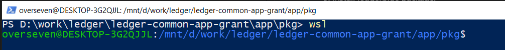

5. Install ledgerblue package:
```bash 
pip3 install ledgerblue --user
```
6. Connect Ledger to computer via USB and unlock by enter PIN
7. Open [Powershell as admin](https://adamtheautomator.com/powershell-run-as-administrator/) in new window and get a list of connected device:
```bash
usbipd list
```
8. Find BUSID of Ledger device (in this case BUSID is __2-4__)

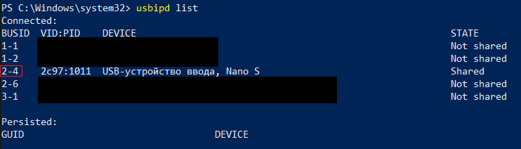

9. Attach Ledger to WSL by using BUSID from previous step:
```bash
usbipd wsl attach --busid 2-4
```
10. Do not disconnect Ledger and stay on apps catalog page before loading Substrate app is finished

## Load app to Ledger device
1. Go to [latest release page](https://github.com/eq-lab/app-substrate-common/releases/latest)
2. Download __installer_s.sh__ for Ledger Nano S, or __installer_s2.sh__ for Ledger Nano S Plus
   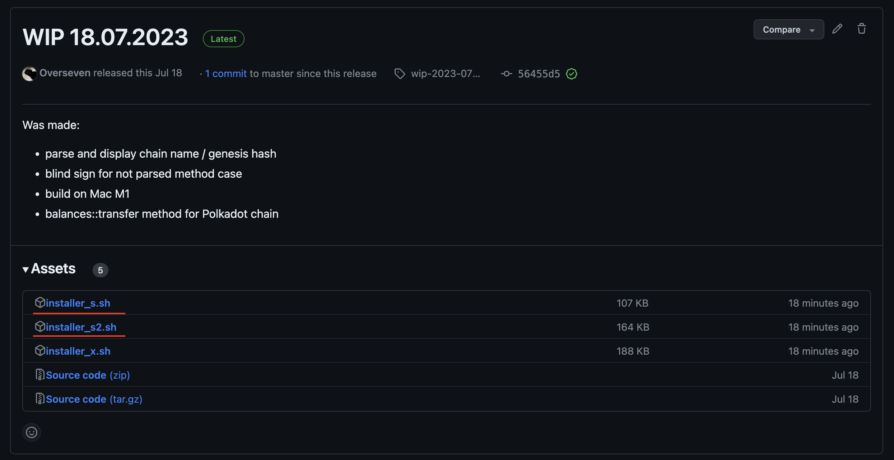
3. Connect Ledger device to computer via USB
4. Unlock Ledger and go to catalog of apps screen
   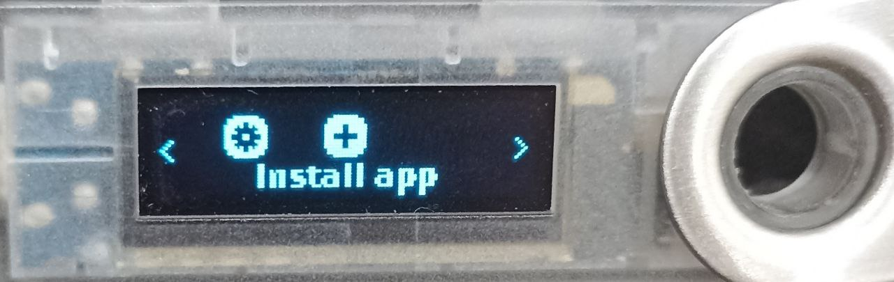
5. Execute installer script:

- On Linux:
```bash
chmod +rwx installer_s.sh 
installer_s.sh load
```

- On Mac OS:
```bash
/bin/bash installer_s.sh load
```

- On Windows:
```bash
wsl
sudo ./installer_s.sh load
```
You will receive a _"No dongle found"_ error message if any of these conditions are not met:
- Ledger device is connected to a computer via a USB
- Ledger device is unlocked
- A page of apps catalog is opened on Ledger

### Confirmation installation on Ledger
On the Ledger device, you will see these pages:

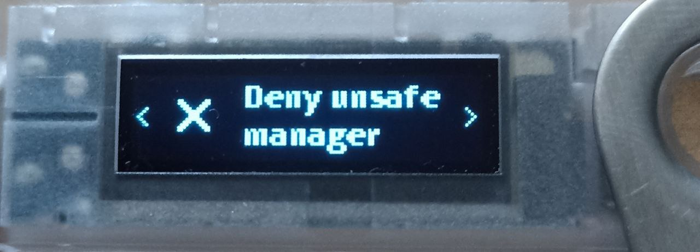

Click the left button and select _"Allow unsafe manager"_:

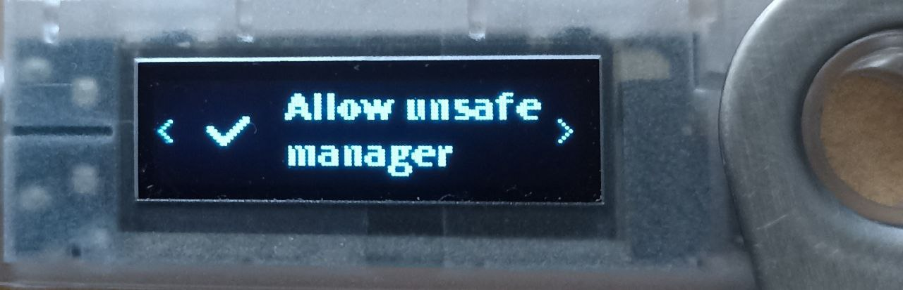

App will be loaded to Ledger device:

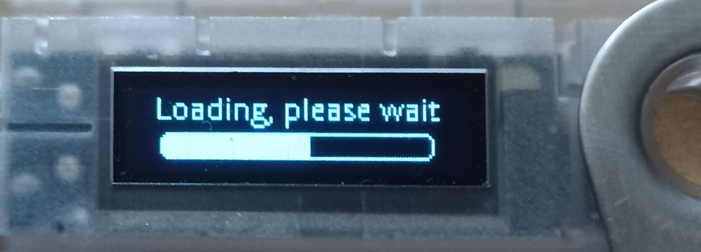

After app loading is finished, the page _"Install app Substrate"_ will be open:

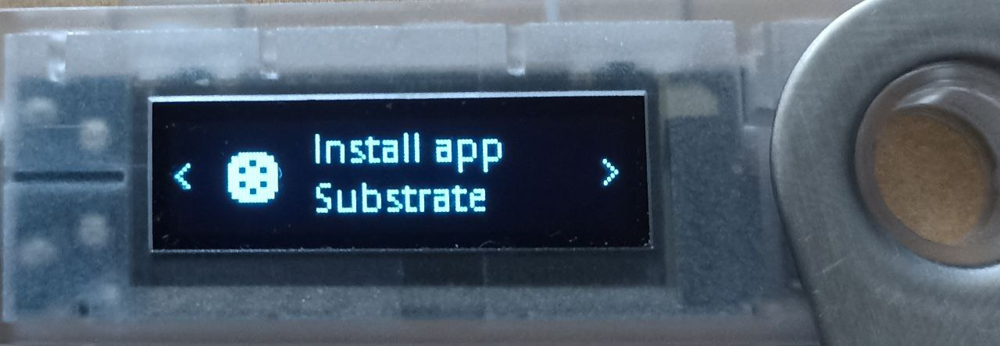

Click twice the left button and select _"Perform installation"_:

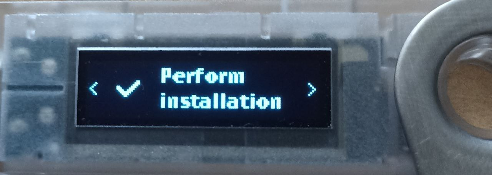

Enter PIN to confirm installation:

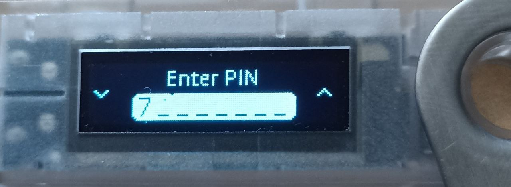

After confirmation app will be ready to use:

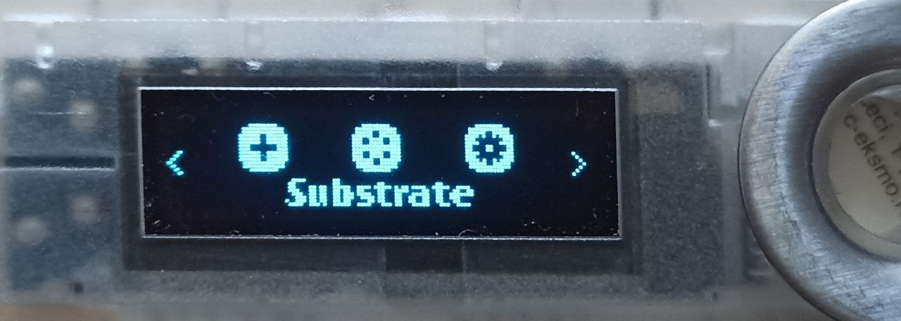